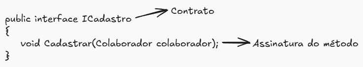

# Interfaces

## Conceito 

As interfaces são contratos descritos no código onde, temos a implementação de assinaturas de métodos que definem como esses métodos deverão ser criados, nas classes que implementam essa interface. As interfaces são artifícios muito importantes na modularização do código, fazendo com que as classes que as implementam, não dependam da implementação dos métodos, mas sim da sua abstração. Dessa forma, deixamos o código mais desacoplado.


- Exexmplo de Interface
```csharp
//Definição da interface
public interface ICadastro
{
  void Cadastrar(Colaborador colaborador); //Definição da assinatura do método
}
```

- Após criar a interface e as assinaturas dos métodos, as classes que implementarão essa interface, precisa herdá-la.

```csharp
public class Cadastro : ICadastro
{
  void Cadastrar(Colaborador colaborador)
  {
    //... Implementação do método
  }
}
```

Dessa forma, os métodos presente na classe são os métodos assinados na interface.

> A classe que herda a interface pode ainda, ter seus métodos próprios. Não sendo obrigado que essa classe apenas implemente os métodos assinados na interface.

As classes podem, também, implementar mais de uma interface. A lógica aplicada na implementação da interface é a mesma, a única coisa que muda é que indicamos mais de uma interface na herança da classe. Dessa forma, temos algo semelhante a isto:

- Criação da interface de Listagem
```csharp
public interface IListagem
{
  void ListarTodos();
}
```
- Implementação da interface na classe de Cadastro
```csharp
//Implementação da classe Cadastro herdando as interfaces ICadastro e IListagem
public class Cadastro : ICadastro, IListagem
{
  void Cadastrar(Colaborador colaborador)
  {
    //... Implementação do método
  }

  void ListarTodos()
  {
    //... Implementação do método
  }

}
```

> Dessa forma, podemos implementar N interfaces diferentes na mesma classe caso seja necessário. Garantindo que, as classes sejam padronizadas e desacopladas. Já que os comportamentos descritos nas assinaturas dos métodos são os mesmos para todas as classes que implementam as interfaces.